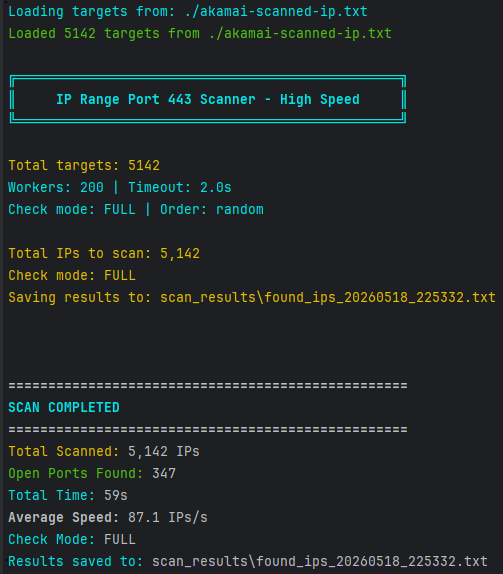

# IP Range Port 443 Scanner

High-performance parallel port scanner for testing port 443 across multiple IP ranges.

Scan Akamai CDN ips for [shirokhorshid-android](https://github.com/shirokhorshid/shirokhorshid-android).

## Features

- Parallel scanning with configurable worker threads
- Real-time progress animation
- Color-coded output
- Statistics and per-range breakdowns
- Save results to file
- Custom IP range support

## Usage

### Default Range Scan
```bash
python scanner.py
```

### File Scan (Recommended)
```bash
python scanner.py -f ./akamai-scanned-ip.txt
python scanner.py -f ./akamai-scanned-ip.txt -m full -w 200 
```

#### Read `--help` for more information

### ScreenShot
